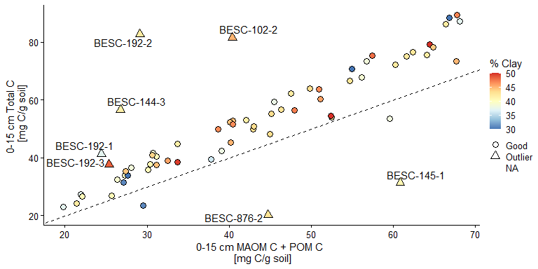

# Harmonizing Clatskanie Datasets for GCB Publication
Brandon Sloan
10 August, 2025

# Introduction

We harmonized several different data sets collected at the Clatskanie
Common Garden Site over the past few years for this *Global Change
Biology* manuscript. We will briefly describe soil, root and aboveground
biomass data below and discuss the pre-processing that occurred to
arrive at the final data set used for our heritability and regression
analysis in the manuscript.

# SEED Soil Core Data

Soil cores were collected in 2022 as part of and ORNL SEED project led
by Melanie Mayes. The cores were analyzed for mineral associated,
particulate, and total C and N, organic acids, pH, and soil textural
data. The cores were taken for 23 genotypes with 3 replicates for most
genotypes (66 cores total), with an additional genotype taken as part of
a later project (BESC-13). The cores were taken at 15 and 30 cm, with a
few cores having deeper measurements. As part of the harmonization, I
have identified each tree based on its genotype label and replicate
block, which are represented by the *tree, genotype,* and *block*
columns in all of the following tables.

<details class="code-fold">
<summary>Code</summary>

``` r
# Clatskanie latitude and longitude data from Stan Martins
df_ll <-
  read_csv(
    file.path(d_path,"03-cbi/clatskanie-lat-lon.csv")) |> 
  mutate(genotype = as.factor(CBI_genotype),
         block = as.factor(CBI_block),
         tree = fct_cross(genotype,block,sep = "-")
         ) |> 
    select(tree,latitude,longitude) |> 
    group_by(tree) |> 
    summarize(across(.cols = c(latitude,longitude),first))

# SEED soil core data
df_core <-
  read_xlsx(file.path(d_path, "01-seed/seed-soil-core-update-besc-13.xlsx"),
            sheet = "Soils") |>
  mutate(
    genotype = as.factor(Genotype),
    block = as.factor(Block),
    tree = fct_cross(genotype, block, sep = "-"),
    across(c(TotpN, TotpC), as.numeric)
  ) |>
  left_join(df_ll, by = "tree") |>
  select(tree,
         genotype,
         block,
         Depth,
         latitude,
         longitude,
         Row,
         Column,
         Trait:Citrate) |>
  mutate(
    TotC = TotpC * 10,
    # convert to units tonnes mg C/g soil
    C_chk = abs((MAOMC + POMC - TotC) / TotC * 100),
    C_chk_rel = (MAOMC + POMC - TotC) / TotC * 100,
    C_chk_abs = (MAOMC + POMC - TotC)
  )

display_table <- function(df){
 head(df) |> 
    gt()|> 
    fmt_number(columns = where(is.numeric), decimals = 2) 
}


display_table(df_core)
```

</details>
<div id="tbl-seed-core">

<div class="cell-output-display">

<div id="hvdylurgmf" style="padding-left:0px;padding-right:0px;padding-top:10px;padding-bottom:10px;overflow-x:auto;overflow-y:auto;width:auto;height:auto;">
<style>#hvdylurgmf table {
  font-family: system-ui, 'Segoe UI', Roboto, Helvetica, Arial, sans-serif, 'Apple Color Emoji', 'Segoe UI Emoji', 'Segoe UI Symbol', 'Noto Color Emoji';
  -webkit-font-smoothing: antialiased;
  -moz-osx-font-smoothing: grayscale;
}
&#10;#hvdylurgmf thead, #hvdylurgmf tbody, #hvdylurgmf tfoot, #hvdylurgmf tr, #hvdylurgmf td, #hvdylurgmf th {
  border-style: none;
}
&#10;#hvdylurgmf p {
  margin: 0;
  padding: 0;
}
&#10;#hvdylurgmf .gt_table {
  display: table;
  border-collapse: collapse;
  line-height: normal;
  margin-left: auto;
  margin-right: auto;
  color: #333333;
  font-size: 16px;
  font-weight: normal;
  font-style: normal;
  background-color: #FFFFFF;
  width: auto;
  border-top-style: solid;
  border-top-width: 2px;
  border-top-color: #A8A8A8;
  border-right-style: none;
  border-right-width: 2px;
  border-right-color: #D3D3D3;
  border-bottom-style: solid;
  border-bottom-width: 2px;
  border-bottom-color: #A8A8A8;
  border-left-style: none;
  border-left-width: 2px;
  border-left-color: #D3D3D3;
}
&#10;#hvdylurgmf .gt_caption {
  padding-top: 4px;
  padding-bottom: 4px;
}
&#10;#hvdylurgmf .gt_title {
  color: #333333;
  font-size: 125%;
  font-weight: initial;
  padding-top: 4px;
  padding-bottom: 4px;
  padding-left: 5px;
  padding-right: 5px;
  border-bottom-color: #FFFFFF;
  border-bottom-width: 0;
}
&#10;#hvdylurgmf .gt_subtitle {
  color: #333333;
  font-size: 85%;
  font-weight: initial;
  padding-top: 3px;
  padding-bottom: 5px;
  padding-left: 5px;
  padding-right: 5px;
  border-top-color: #FFFFFF;
  border-top-width: 0;
}
&#10;#hvdylurgmf .gt_heading {
  background-color: #FFFFFF;
  text-align: center;
  border-bottom-color: #FFFFFF;
  border-left-style: none;
  border-left-width: 1px;
  border-left-color: #D3D3D3;
  border-right-style: none;
  border-right-width: 1px;
  border-right-color: #D3D3D3;
}
&#10;#hvdylurgmf .gt_bottom_border {
  border-bottom-style: solid;
  border-bottom-width: 2px;
  border-bottom-color: #D3D3D3;
}
&#10;#hvdylurgmf .gt_col_headings {
  border-top-style: solid;
  border-top-width: 2px;
  border-top-color: #D3D3D3;
  border-bottom-style: solid;
  border-bottom-width: 2px;
  border-bottom-color: #D3D3D3;
  border-left-style: none;
  border-left-width: 1px;
  border-left-color: #D3D3D3;
  border-right-style: none;
  border-right-width: 1px;
  border-right-color: #D3D3D3;
}
&#10;#hvdylurgmf .gt_col_heading {
  color: #333333;
  background-color: #FFFFFF;
  font-size: 100%;
  font-weight: normal;
  text-transform: inherit;
  border-left-style: none;
  border-left-width: 1px;
  border-left-color: #D3D3D3;
  border-right-style: none;
  border-right-width: 1px;
  border-right-color: #D3D3D3;
  vertical-align: bottom;
  padding-top: 5px;
  padding-bottom: 6px;
  padding-left: 5px;
  padding-right: 5px;
  overflow-x: hidden;
}
&#10;#hvdylurgmf .gt_column_spanner_outer {
  color: #333333;
  background-color: #FFFFFF;
  font-size: 100%;
  font-weight: normal;
  text-transform: inherit;
  padding-top: 0;
  padding-bottom: 0;
  padding-left: 4px;
  padding-right: 4px;
}
&#10;#hvdylurgmf .gt_column_spanner_outer:first-child {
  padding-left: 0;
}
&#10;#hvdylurgmf .gt_column_spanner_outer:last-child {
  padding-right: 0;
}
&#10;#hvdylurgmf .gt_column_spanner {
  border-bottom-style: solid;
  border-bottom-width: 2px;
  border-bottom-color: #D3D3D3;
  vertical-align: bottom;
  padding-top: 5px;
  padding-bottom: 5px;
  overflow-x: hidden;
  display: inline-block;
  width: 100%;
}
&#10;#hvdylurgmf .gt_spanner_row {
  border-bottom-style: hidden;
}
&#10;#hvdylurgmf .gt_group_heading {
  padding-top: 8px;
  padding-bottom: 8px;
  padding-left: 5px;
  padding-right: 5px;
  color: #333333;
  background-color: #FFFFFF;
  font-size: 100%;
  font-weight: initial;
  text-transform: inherit;
  border-top-style: solid;
  border-top-width: 2px;
  border-top-color: #D3D3D3;
  border-bottom-style: solid;
  border-bottom-width: 2px;
  border-bottom-color: #D3D3D3;
  border-left-style: none;
  border-left-width: 1px;
  border-left-color: #D3D3D3;
  border-right-style: none;
  border-right-width: 1px;
  border-right-color: #D3D3D3;
  vertical-align: middle;
  text-align: left;
}
&#10;#hvdylurgmf .gt_empty_group_heading {
  padding: 0.5px;
  color: #333333;
  background-color: #FFFFFF;
  font-size: 100%;
  font-weight: initial;
  border-top-style: solid;
  border-top-width: 2px;
  border-top-color: #D3D3D3;
  border-bottom-style: solid;
  border-bottom-width: 2px;
  border-bottom-color: #D3D3D3;
  vertical-align: middle;
}
&#10;#hvdylurgmf .gt_from_md > :first-child {
  margin-top: 0;
}
&#10;#hvdylurgmf .gt_from_md > :last-child {
  margin-bottom: 0;
}
&#10;#hvdylurgmf .gt_row {
  padding-top: 8px;
  padding-bottom: 8px;
  padding-left: 5px;
  padding-right: 5px;
  margin: 10px;
  border-top-style: solid;
  border-top-width: 1px;
  border-top-color: #D3D3D3;
  border-left-style: none;
  border-left-width: 1px;
  border-left-color: #D3D3D3;
  border-right-style: none;
  border-right-width: 1px;
  border-right-color: #D3D3D3;
  vertical-align: middle;
  overflow-x: hidden;
}
&#10;#hvdylurgmf .gt_stub {
  color: #333333;
  background-color: #FFFFFF;
  font-size: 100%;
  font-weight: initial;
  text-transform: inherit;
  border-right-style: solid;
  border-right-width: 2px;
  border-right-color: #D3D3D3;
  padding-left: 5px;
  padding-right: 5px;
}
&#10;#hvdylurgmf .gt_stub_row_group {
  color: #333333;
  background-color: #FFFFFF;
  font-size: 100%;
  font-weight: initial;
  text-transform: inherit;
  border-right-style: solid;
  border-right-width: 2px;
  border-right-color: #D3D3D3;
  padding-left: 5px;
  padding-right: 5px;
  vertical-align: top;
}
&#10;#hvdylurgmf .gt_row_group_first td {
  border-top-width: 2px;
}
&#10;#hvdylurgmf .gt_row_group_first th {
  border-top-width: 2px;
}
&#10;#hvdylurgmf .gt_summary_row {
  color: #333333;
  background-color: #FFFFFF;
  text-transform: inherit;
  padding-top: 8px;
  padding-bottom: 8px;
  padding-left: 5px;
  padding-right: 5px;
}
&#10;#hvdylurgmf .gt_first_summary_row {
  border-top-style: solid;
  border-top-color: #D3D3D3;
}
&#10;#hvdylurgmf .gt_first_summary_row.thick {
  border-top-width: 2px;
}
&#10;#hvdylurgmf .gt_last_summary_row {
  padding-top: 8px;
  padding-bottom: 8px;
  padding-left: 5px;
  padding-right: 5px;
  border-bottom-style: solid;
  border-bottom-width: 2px;
  border-bottom-color: #D3D3D3;
}
&#10;#hvdylurgmf .gt_grand_summary_row {
  color: #333333;
  background-color: #FFFFFF;
  text-transform: inherit;
  padding-top: 8px;
  padding-bottom: 8px;
  padding-left: 5px;
  padding-right: 5px;
}
&#10;#hvdylurgmf .gt_first_grand_summary_row {
  padding-top: 8px;
  padding-bottom: 8px;
  padding-left: 5px;
  padding-right: 5px;
  border-top-style: double;
  border-top-width: 6px;
  border-top-color: #D3D3D3;
}
&#10;#hvdylurgmf .gt_last_grand_summary_row_top {
  padding-top: 8px;
  padding-bottom: 8px;
  padding-left: 5px;
  padding-right: 5px;
  border-bottom-style: double;
  border-bottom-width: 6px;
  border-bottom-color: #D3D3D3;
}
&#10;#hvdylurgmf .gt_striped {
  background-color: rgba(128, 128, 128, 0.05);
}
&#10;#hvdylurgmf .gt_table_body {
  border-top-style: solid;
  border-top-width: 2px;
  border-top-color: #D3D3D3;
  border-bottom-style: solid;
  border-bottom-width: 2px;
  border-bottom-color: #D3D3D3;
}
&#10;#hvdylurgmf .gt_footnotes {
  color: #333333;
  background-color: #FFFFFF;
  border-bottom-style: none;
  border-bottom-width: 2px;
  border-bottom-color: #D3D3D3;
  border-left-style: none;
  border-left-width: 2px;
  border-left-color: #D3D3D3;
  border-right-style: none;
  border-right-width: 2px;
  border-right-color: #D3D3D3;
}
&#10;#hvdylurgmf .gt_footnote {
  margin: 0px;
  font-size: 90%;
  padding-top: 4px;
  padding-bottom: 4px;
  padding-left: 5px;
  padding-right: 5px;
}
&#10;#hvdylurgmf .gt_sourcenotes {
  color: #333333;
  background-color: #FFFFFF;
  border-bottom-style: none;
  border-bottom-width: 2px;
  border-bottom-color: #D3D3D3;
  border-left-style: none;
  border-left-width: 2px;
  border-left-color: #D3D3D3;
  border-right-style: none;
  border-right-width: 2px;
  border-right-color: #D3D3D3;
}
&#10;#hvdylurgmf .gt_sourcenote {
  font-size: 90%;
  padding-top: 4px;
  padding-bottom: 4px;
  padding-left: 5px;
  padding-right: 5px;
}
&#10;#hvdylurgmf .gt_left {
  text-align: left;
}
&#10;#hvdylurgmf .gt_center {
  text-align: center;
}
&#10;#hvdylurgmf .gt_right {
  text-align: right;
  font-variant-numeric: tabular-nums;
}
&#10;#hvdylurgmf .gt_font_normal {
  font-weight: normal;
}
&#10;#hvdylurgmf .gt_font_bold {
  font-weight: bold;
}
&#10;#hvdylurgmf .gt_font_italic {
  font-style: italic;
}
&#10;#hvdylurgmf .gt_super {
  font-size: 65%;
}
&#10;#hvdylurgmf .gt_footnote_marks {
  font-size: 75%;
  vertical-align: 0.4em;
  position: initial;
}
&#10;#hvdylurgmf .gt_asterisk {
  font-size: 100%;
  vertical-align: 0;
}
&#10;#hvdylurgmf .gt_indent_1 {
  text-indent: 5px;
}
&#10;#hvdylurgmf .gt_indent_2 {
  text-indent: 10px;
}
&#10;#hvdylurgmf .gt_indent_3 {
  text-indent: 15px;
}
&#10;#hvdylurgmf .gt_indent_4 {
  text-indent: 20px;
}
&#10;#hvdylurgmf .gt_indent_5 {
  text-indent: 25px;
}
</style>

| tree | genotype | block | Depth | latitude | longitude | Row | Column | Trait | BD | MCwetBD | MCdryBD | MCwetCHEM | MCdryCHEM | pH | Sand | Clay | Silt | POMpN | POMpC | MAOMpN | MAOMpC | POMN | POMC | MAOMN | MAOMC | TotpN | TotpC | OrgAcidMass | Lactate_conc | Acetate_conc | Propionate_conc | Formate_conc | Butyrate_conc | Pyruvate_conc | Succinate_conc | Oxalate_conc | Furmarate_conc | Citrate_conc | Lactate | Acetate | Propionate | Formate | Butyrate | Pyruvate | Succinate | Oxalate | Furmarate | Citrate | TotC | C_chk | C_chk_rel | C_chk_abs |
|----|----|----|----|----|----|----|----|----|----|----|----|----|----|----|----|----|----|----|----|----|----|----|----|----|----|----|----|----|----|----|----|----|----|----|----|----|----|----|----|----|----|----|----|----|----|----|----|----|----|----|----|----|
| BESC-102-1 | BESC-102 | 1 | 15.00 | 46.12 | −123.27 | 18.00 | 8.00 | HF | 0.88 | 0.37 | 0.60 | 0.42 | 0.72 | 5.11 | 0.00 | 45.90 | 55.75 | 0.89 | 19.61 | 0.31 | 4.05 | 0.53 | 11.56 | 3.05 | 39.52 | 0.41 | 6.04 | 1.21 | 19.89 | 9.44 | 14.05 | 9.24 | 0.00 | 0.00 | 0.00 | 0.00 | 4.33 | 0.00 | 26.241100053454279 | 12.447701307407799 | 18.542919117712412 | 12.190435620609227 | 0 | 0 | 0 | 0 | 5.7165754917856901 | 0 | 60.40 | 15.43 | −15.43 | −9.32 |
| BESC-102-1 | BESC-102 | 1 | 30.00 | 46.12 | −123.27 | 18.00 | 8.00 | HF | 0.61 | 0.32 | 0.47 | 0.31 | 0.44 | 5.41 | 0.00 | 50.45 | 50.45 | NA | NA | NA | NA | NA | NA | NA | NA | 0.16 | 2.09 | 1.24 | 26.03 | 0.00 | 0.00 | 0.00 | 0.00 | 0.00 | 0.00 | 0.00 | 4.24 | 0.00 | 30.761400137078475 | 0 | 0 | 0 | 0 | 0 | 0 | 0 | 5.0045918167003709 | 0 | 20.90 | NA | NA | NA |
| BESC-102-2 | BESC-102 | 2 | 15.00 | 46.12 | −123.27 | 61.00 | 21.00 | HF | 0.62 | 0.41 | 0.69 | 0.43 | 0.77 | 5.09 | 7.85 | 45.15 | 47.00 | 0.81 | 16.53 | 0.30 | 3.40 | 0.40 | 8.11 | 2.83 | 32.30 | 0.53 | 8.15 | 1.29 | 11.48 | 12.30 | 14.13 | 8.95 | 0.00 | 0.00 | 0.00 | 0.00 | 4.27 | 0.00 | 15.06244404695275 | 16.14911335695335 | 18.540310799973991 | 11.747315209921938 | 0 | 0 | 0 | 0 | 5.6000216736383539 | 0 | 81.50 | 50.42 | −50.42 | −41.09 |
| BESC-102-2 | BESC-102 | 2 | 30.00 | 46.12 | −123.27 | 61.00 | 21.00 | HF | 0.62 | 0.45 | 0.82 | 0.41 | 0.70 | 6.15 | 0.35 | 52.15 | 47.50 | NA | NA | NA | NA | NA | NA | NA | NA | 0.44 | 6.54 | 1.28 | 8.91 | 0.00 | 0.00 | 0.00 | 0.00 | 0.00 | 0.00 | 0.00 | 4.30 | 0.00 | 12.678931857096265 | 0 | 0 | 0 | 0 | 0 | 0 | 0 | 6.1161551475784091 | 0 | 65.40 | NA | NA | NA |
| BESC-102-3 | BESC-102 | 3 | 15.00 | 46.12 | −123.27 | 92.00 | 22.00 | HF | 0.79 | 0.32 | 0.48 | 0.35 | 0.54 | 5.70 | 8.39 | 38.21 | 51.20 | 0.64 | 13.30 | 0.40 | 5.64 | 0.37 | 7.59 | 3.68 | 51.99 | 0.38 | 5.35 | 1.08 | 9.20 | 0.00 | 0.00 | 0.00 | 0.00 | 0.00 | 0.00 | 0.00 | 0.00 | 0.00 | 12.609040922118737 | 0 | 0 | 0 | 0 | 0 | 0 | 0 | 0 | 0 | 53.50 | 11.36 | 11.36 | 6.08 |
| BESC-102-3 | BESC-102 | 3 | 30.00 | 46.12 | −123.27 | 92.00 | 22.00 | HF | 0.83 | 0.33 | 0.50 | 0.35 | 0.54 | 5.34 | 0.00 | 45.90 | 55.00 | NA | NA | NA | NA | NA | NA | NA | NA | 0.29 | 3.27 | 1.01 | 0.00 | 0.00 | 0.00 | 0.00 | 0.00 | 0.00 | 0.00 | 0.00 | 0.00 | 0.00 | 0 | 0 | 0 | 0 | 0 | 0 | 0 | 0 | 0 | 0 | 32.70 | NA | NA | NA |

</div>

</div>

Table 1: SEED soil core data collected in 2022.

</div>
<div id="tbl-seed-core-key">

| Variable | Description | Units |
|----|----|----|
| tree | Unique ID for all poplar trees across these data sets (max of 66 trees) |  |
| genotype | ID for genotypes contained across these data sets (max of 23 genotypes) |  |
| block | ID for replicate blocks (max of 3 replicates) |  |
| Depth | Depth that soil core was taken to at each tree (max of 4 depths) | cm |
| Traits | The aboveground phenotypic traits used to select the soil cores |  |
| BD | Soil bulk density | g/cm$^3$ |
| MCwetBD, MCdryBD, MCwetCHEM, MCwetBD | Wet and dry soil moisture content from bulk density and chemistry samples | cm$^3$ water/ cm$^3$ soil |
| pH | Soil acidity |  |
| Sand | Percent Sand | % |
| Clay | Percent Clay | % |
| Silt | Percent Silt | % |
| POMpN, POMpC | Particulate organic matter percent Carbon and Nitrogen | % |
| POMN, POMC | Particulate organic matter percent Carbon and Nitrogen | mg C or N/g soil |
| MAOMpN, MAOMpC | Mineral associated organic matter percent C and N | % |
| MAOMN, MAOMC | Mineral associated organic matter C and N | mg C or N/g soil |
| TotpN, TotpC | Total percent N or C | % |
| OrgAcidMass | Fresh soil mass for organic acid analysis | g |
| Lactate_conc, Acetate_conc, … | Organic acid concentrations | $\mu$moles |
| Lactate, Acetate, … | Specific organic acid concentrations | $\mu$moles/g soil |

Table 2: <a href="#tbl-seed-core" class="quarto-xref">Table 1</a> key

</div>

## C Mass Balance Discrepancy

<details class="code-fold">
<summary>Code</summary>

``` r
# Combined data set for prelim analysis and plotting
df_check <-
  df_core |> filter(Depth == 15) |>
  select(tree:TotpC) |>
  mutate(
    TotC = TotpC * 10, # convert to units tonnes mg C/g soil
    C_chk = abs((MAOMC + POMC - TotC) / TotC * 100),
    C_chk_rel = (MAOMC + POMC - TotC) / TotC * 100,
    C_chk_abs = (MAOMC + POMC - TotC),
    C_chk_id = fct(ifelse(C_chk > 30, "Outlier", "Good")),
    C_chk_plt = fct(ifelse(C_chk > 30, as.character(tree), ""))
  )

outliers <-
  df_check |>
  filter(C_chk_id %in% "Outlier") |>
  pluck("tree") |>
  as.character()
```

</details>

I initially checked the soil C measurements to ensure that the MAOM and
POM soil C fractions matched the overall total C, since they were
measured from separate sub-samples. We considered mass balance errors
greater than 30% as unacceptable.
<a href="#fig-c-chk" class="quarto-xref">Figure 1</a> shows the seven
trees that have unrealistic mass balance (BESC-102-2, BESC-876-2,
BESC-144-3, BESC-192-1, BESC-192-2, BESC-192-3, BESC-145-1). Therefore,
the elemental analysis (and not fractionation) were re-run for these
outliers by Tommy Mead with replicates to characterize the experimental
error.

<details class="code-fold">
<summary>Code</summary>

``` r
# Sanity check on MAOM and POM calcs
g1 <- df_check |>
  ggplot(aes(
    x = MAOMC + POMC,
    y = TotC,
    fill = Clay,
    shape = C_chk_id,
    label = C_chk_plt
  )) +
  geom_point(size = 3) +
  geom_text_repel() +
  geom_abline(slope = 1,
              intercept = 0,
              linetype = 2) +
  scale_shape_manual(name = NULL,
                     values = c("Outlier" = 24, "Good" = 21)) +
  scale_fill_distiller(
    name = "% Clay",
    palette = "RdYlBu",
    type = "div",
    limits = c(30, 50),
    oob = scales::squish
  ) +
  xlab("0-15 cm MAOM C + POM C \n [mg C/g soil]") +
  ylab("0-15 cm Total C \n [mg C/g soil]") +
  theme_cowplot(fs)
plot(g1)
```

</details>
<div id="fig-c-chk">




Figure 1: Sanity check on soil C mass balance showing the sums of
Mineral Associated Soil C and Particulate Soil C observations versus the
Total Soil C..

</div>

The re-run samples are compared to the original values and checked
against the mass balance

<details class="code-fold">
<summary>Code</summary>

``` r
# Read Original Fractionation data
df_frac <-
  file.path(d_path, "01-seed/seed-maom-pom-fractionation.xlsx") |>
  read_xlsx(sheet = "POM_MAOM_raw_and_calcs",
            skip = 1) |>
  select(`Full ID`, `Soil dry weight (g)`, `POM mass`, `MAOM mass`) |>
  mutate(
    genotype = ifelse(
      str_detect(`Full ID`, "ROAD"),
      "ROAD",
      str_extract(`Full ID`, "[:upper:]+(\\-|\\s|\\S)\\d+\\-?\\d*")
    ),
    block = ifelse(
      str_detect(`Full ID`, "ROAD"),
      1,
      str_extract(`Full ID`, "(?<=(Cl|CL|U))\\d+")
    ),
    tree = paste(genotype, block, sep = "-"),
    across(genotype:tree, fct),
    pom_frac = `POM mass` / `Soil dry weight (g)`,
    maom_frac = `MAOM mass` / `Soil dry weight (g)`
  ) |>
  drop_na()
```

</details>
<details class="code-fold">
<summary>Code</summary>

``` r
# Read in updated samples from Tommy Mead by 01/02/24
df_core_update_1 <-
  list.files(file.path(d_path,
                       "02-ldrd/"), "*Tray*", full.names = TRUE) |>
  map(
    \(x)
    read_xlsx(x,
              sheet = "Output") |>
      filter(Type %in% "Test") |>
      select(`Sample ID`:`Final %C`)
  ) |>
  bind_rows() |>
  mutate(
    genotype = ifelse(
      str_detect(`Sample ID`, "ROAD"),
      "ROAD",
      str_extract(`Sample ID`, "[:alpha:]+(\\-|\\s|\\S)\\d+\\-?\\d*")
    ) |> str_to_upper(),
    block = ifelse(
      str_detect(`Sample ID`, "ROAD"),
      1,
      str_extract(`Sample ID`, "(?<=(Cl|CL|U))\\d+")
    ),
    rep = str_extract(`Sample ID`, "(?<=r)\\d+"),
    tree = paste(genotype, block, sep = "-"),
    fraction = case_when(
      str_detect(`Sample ID`, "MOAM") ~ "MAOM",
      str_detect(`Sample ID`, "POM") ~ "POM",
      .default = "Tot"
    ),
    depth = ifelse(fraction %in% "Tot",
                   ifelse(str_detect(`Sample ID`, "_30"),
                          "30",
                          "15"),
                   "15"),
    across(genotype:depth, fct)
  ) |>
  select(-`Sample ID`) |>
  filter(depth  %in% "15") |>
  rename(pN = `Final %N`,
         pC = `Final %C`,
         weight = `Weight [mg]`) |>
  pivot_wider(
    names_from = fraction,
    values_from = c(weight, pN, pC),
    names_glue = "{fraction}{.value}"
  ) |>
  left_join(df_frac |> select(tree, pom_frac, maom_frac), by = "tree") |>
  drop_na() |>
  mutate(
    MAOMN = maom_frac * MAOMpN * 10,
    POMN = pom_frac * POMpN * 10,
    TotN = TotpN * 10,
    MAOMC = maom_frac * MAOMpC * 10,
    POMC = pom_frac * POMpC * 10,
    TotC = TotpC * 10,
    C_chk = abs((MAOMC + POMC - TotC) / TotC * 100),
    C_chk_abs = (MAOMC + POMC - TotC),
    C_chk_rel = (MAOMC + POMC - TotC) / TotC * 100,
    C_chk_id = fct(ifelse(C_chk > 30, "Outlier", "Good"))
  )

# Read in updated samples from Tommy Mead on 03/07/24
df_core_update_2 <-
  list.files(file.path(d_path,
                       "02-ldrd/"), "*Rerun*", full.names = TRUE) |>
  map(
    \(x)
    read_xlsx(x,
              sheet = "Output") |>
      filter(Type %in% "Test") |>
      select(`Sample ID`:`Final %C`)
  ) |>
  bind_rows() |>
  mutate(
    genotype = 
      str_extract(`Sample ID`, "[:alpha:]+(\\-|\\s|\\S)\\d+") |> 
      str_to_upper() |> 
      str_replace(" ","-"),
    block = str_extract(`Sample ID`, "(?<=(\\-))\\d+"),
    rep = str_extract(`Sample ID`, "\\d+$"),
    tree = paste(genotype, block, sep = "-"),
    fraction = case_when(
      str_detect(`Sample ID`, "MOAM") ~ "MAOM",
      str_detect(`Sample ID`, "Pom") ~ "POM",
      .default = "Tot"
    ),
    depth = ifelse(fraction %in% "Tot",
                   ifelse(str_detect(`Sample ID`, "_30"),
                          "30",
                          "15"),
                   "15"),
    across(genotype:depth, fct)
  ) |>
  select(-`Sample ID`) |>
  filter(depth  %in% "15") |>
  rename(pN = `Final %N`,
         pC = `Final %C`,
         weight = `Weight [mg]`) |>
  pivot_wider(
    names_from = fraction,
    values_from = c(weight, pN, pC),
    names_glue = "{fraction}{.value}"
  ) |>
  left_join(df_frac |> select(tree, pom_frac, maom_frac), by = "tree") |>
  drop_na() |>
  mutate(
    MAOMN = maom_frac * MAOMpN * 10,
    POMN = pom_frac * POMpN * 10,
    TotN = TotpN * 10,
    MAOMC = maom_frac * MAOMpC * 10,
    POMC = pom_frac * POMpC * 10,
    TotC = TotpC * 10,
    C_chk = abs((MAOMC + POMC - TotC) / TotC * 100),
    C_chk_abs = (MAOMC + POMC - TotC),
    C_chk_rel = (MAOMC + POMC - TotC) / TotC * 100,
    C_chk_id = fct(ifelse(C_chk > 30, "Outlier", "Good"))
  )
```

</details>
<details class="code-fold">
<summary>Code</summary>

``` r
# Combine new samples with fractionation data
df_update_plt <-
  bind_rows(list(`01/24 EA` = df_core_update_1,
                 `03/24 EA` = df_core_update_2,
                 "Original EA" = df_check |>
              filter(C_chk_id %in% "Outlier")), .id = "run") |>
  select(run, tree, genotype, MAOMC:C_chk_id)

g1a <-  df_update_plt |>
  ggplot(aes(
    x = tree,
    y = C_chk_rel,
    shape = C_chk_id,
    color = run,
    fill = run
  )) +
  geom_hline(yintercept = 30,
             linetype = 2,
             color = "red") +
  geom_hline(yintercept = -30,
             linetype = 2,
             color = "red") +
  geom_jitter(size = 3,
              position = position_dodge2(width = 0.4)) +
  scale_shape_manual(name = NULL,
                     values = c("Outlier" = 24, "Good" = 21)) +
  scale_fill_manual(
    name = "Run",
    values = c(
      `01/24 EA` = "red",
      `03/24 EA` = "green",
      `Original EA` = "white"
    )
  ) +
  scale_color_manual(
    name = "Run",
    values = c(
      `01/24 EA` = "red",
      `03/24 EA` = "green",
      `Original EA` = "black"
    )
  ) +
  xlab(NULL) +
  ylab("Percent Error,\n (MAOM C + POM C - Total C)/Total C") +
  theme_cowplot(fs) +
  theme(axis.text.x = element_blank()) 

g1b <-  df_update_plt |>
  ggplot(aes(
    x = tree,
    y = C_chk_abs,
    shape = C_chk_id,
    color = run,
    fill = run
  )) +
  geom_hline(yintercept = 0,
             linetype = 2,
             color = "red") +
  geom_jitter(size = 3,
              position = position_dodge2(width = 0.4)) +
  scale_shape_manual(name = NULL,
                     values = c("Outlier" = 24, "Good" = 21)) +
  scale_fill_manual(
    name = "Run",
    values = c(
      `01/24 EA` = "red",
      `03/24 EA` = "green",
      `Original EA` = "white"
    )
  ) +
  scale_color_manual(
    name = "Run",
    values = c(
      `01/24 EA` = "red",
      `03/24 EA` = "green",
      `Original EA` = "black"
    )
  ) +
  xlab(NULL) +
  ylab("Absolute Error [mg C/g soil],\n MAOM C + POM C - Total C") +
  theme_cowplot(fs) +
  theme(axis.text.x = element_text(angle = 30, vjust = 0.5))

g1a / g1b + plot_layout(guides = "collect")
```

</details>
<div id="fig-c-re-run">


Figure 2: Sanity check on soil C mass balance showing the sums of
Mineral Associated Soil C and Particulate Soil C observations versus the
Total Soil C..

</div>
<details class="code-fold">
<summary>Code</summary>

``` r
df_update_plt |>
  pivot_longer(cols = c(TotC, MAOMC, POMC)) |>
  mutate(name = fct_recode(
    name,
    "Total C" = "TotC",
    "MAOM C" = "MAOMC",
    "POM C" = "POMC"
  )) |>
  ggplot(aes(
    x = tree,
    y = value,
    shape = C_chk_id,
    color = run,
    fill = run
  )) +
  geom_jitter(size = 3,
              position = position_dodge2(width = 0.4)) +
  scale_shape_manual(name = NULL,
                     values = c("Outlier" = 24, "Good" = 21)) +
  scale_fill_manual(
    name = "Run",
    values = c(
      `01/24 EA` = "red",
      `03/24 EA` = "green",
      `Original EA` = "white"
    )
  ) +
  scale_color_manual(
    name = "Run",
    values = c(
      `01/24 EA` = "red",
      `03/24 EA` = "green",
      `Original EA` = "black"
    )
  ) +
  ylab("Soil C [mg C/g soil]") +
  xlab(NULL) +
  facet_wrap( ~ name, ncol = 1, scales = "free_y") +
  theme_cowplot(fs) +
  theme(axis.text.x = element_text(angle = 30, vjust = 0.5))
```

</details>
<div id="fig-c-re-run-frac">


Figure 3: Sanity check on soil C mass balance showing the sums of
Mineral Associated Soil C and Particulate Soil C observations versus the
Total Soil C..

</div>

# SEED Root Chemistry Data

Root chemistry was analyzed at each of the SEED soil cores. The
differing nutrients and minerals have units of percent (*p*) and parts
per million (*ppm*). These results can be joined to the soil core data
using the *tree* column.

<details class="code-fold">
<summary>Code</summary>

``` r
# SEED root chemistry data
df_root_ch <-   read_xlsx(
    file.path(d_path,"01-seed/seed-roots-10-10-23.xlsx"),
              sheet = "Sheet1") |> 
  mutate(genotype = as.factor(str_replace(Genotype,"_","-")),
         block = as.factor(Block),
         tree = fct_cross(genotype,block,sep = "-")
         ) |> 
  select(tree,genotype,block,pCa:`Zn ppm`) 


display_table(df_root_ch)
```

</details>
<div id="tbl-seed-rc">

<div class="cell-output-display">

<div id="gsxshhsowb" style="padding-left:0px;padding-right:0px;padding-top:10px;padding-bottom:10px;overflow-x:auto;overflow-y:auto;width:auto;height:auto;">
<style>#gsxshhsowb table {
  font-family: system-ui, 'Segoe UI', Roboto, Helvetica, Arial, sans-serif, 'Apple Color Emoji', 'Segoe UI Emoji', 'Segoe UI Symbol', 'Noto Color Emoji';
  -webkit-font-smoothing: antialiased;
  -moz-osx-font-smoothing: grayscale;
}
&#10;#gsxshhsowb thead, #gsxshhsowb tbody, #gsxshhsowb tfoot, #gsxshhsowb tr, #gsxshhsowb td, #gsxshhsowb th {
  border-style: none;
}
&#10;#gsxshhsowb p {
  margin: 0;
  padding: 0;
}
&#10;#gsxshhsowb .gt_table {
  display: table;
  border-collapse: collapse;
  line-height: normal;
  margin-left: auto;
  margin-right: auto;
  color: #333333;
  font-size: 16px;
  font-weight: normal;
  font-style: normal;
  background-color: #FFFFFF;
  width: auto;
  border-top-style: solid;
  border-top-width: 2px;
  border-top-color: #A8A8A8;
  border-right-style: none;
  border-right-width: 2px;
  border-right-color: #D3D3D3;
  border-bottom-style: solid;
  border-bottom-width: 2px;
  border-bottom-color: #A8A8A8;
  border-left-style: none;
  border-left-width: 2px;
  border-left-color: #D3D3D3;
}
&#10;#gsxshhsowb .gt_caption {
  padding-top: 4px;
  padding-bottom: 4px;
}
&#10;#gsxshhsowb .gt_title {
  color: #333333;
  font-size: 125%;
  font-weight: initial;
  padding-top: 4px;
  padding-bottom: 4px;
  padding-left: 5px;
  padding-right: 5px;
  border-bottom-color: #FFFFFF;
  border-bottom-width: 0;
}
&#10;#gsxshhsowb .gt_subtitle {
  color: #333333;
  font-size: 85%;
  font-weight: initial;
  padding-top: 3px;
  padding-bottom: 5px;
  padding-left: 5px;
  padding-right: 5px;
  border-top-color: #FFFFFF;
  border-top-width: 0;
}
&#10;#gsxshhsowb .gt_heading {
  background-color: #FFFFFF;
  text-align: center;
  border-bottom-color: #FFFFFF;
  border-left-style: none;
  border-left-width: 1px;
  border-left-color: #D3D3D3;
  border-right-style: none;
  border-right-width: 1px;
  border-right-color: #D3D3D3;
}
&#10;#gsxshhsowb .gt_bottom_border {
  border-bottom-style: solid;
  border-bottom-width: 2px;
  border-bottom-color: #D3D3D3;
}
&#10;#gsxshhsowb .gt_col_headings {
  border-top-style: solid;
  border-top-width: 2px;
  border-top-color: #D3D3D3;
  border-bottom-style: solid;
  border-bottom-width: 2px;
  border-bottom-color: #D3D3D3;
  border-left-style: none;
  border-left-width: 1px;
  border-left-color: #D3D3D3;
  border-right-style: none;
  border-right-width: 1px;
  border-right-color: #D3D3D3;
}
&#10;#gsxshhsowb .gt_col_heading {
  color: #333333;
  background-color: #FFFFFF;
  font-size: 100%;
  font-weight: normal;
  text-transform: inherit;
  border-left-style: none;
  border-left-width: 1px;
  border-left-color: #D3D3D3;
  border-right-style: none;
  border-right-width: 1px;
  border-right-color: #D3D3D3;
  vertical-align: bottom;
  padding-top: 5px;
  padding-bottom: 6px;
  padding-left: 5px;
  padding-right: 5px;
  overflow-x: hidden;
}
&#10;#gsxshhsowb .gt_column_spanner_outer {
  color: #333333;
  background-color: #FFFFFF;
  font-size: 100%;
  font-weight: normal;
  text-transform: inherit;
  padding-top: 0;
  padding-bottom: 0;
  padding-left: 4px;
  padding-right: 4px;
}
&#10;#gsxshhsowb .gt_column_spanner_outer:first-child {
  padding-left: 0;
}
&#10;#gsxshhsowb .gt_column_spanner_outer:last-child {
  padding-right: 0;
}
&#10;#gsxshhsowb .gt_column_spanner {
  border-bottom-style: solid;
  border-bottom-width: 2px;
  border-bottom-color: #D3D3D3;
  vertical-align: bottom;
  padding-top: 5px;
  padding-bottom: 5px;
  overflow-x: hidden;
  display: inline-block;
  width: 100%;
}
&#10;#gsxshhsowb .gt_spanner_row {
  border-bottom-style: hidden;
}
&#10;#gsxshhsowb .gt_group_heading {
  padding-top: 8px;
  padding-bottom: 8px;
  padding-left: 5px;
  padding-right: 5px;
  color: #333333;
  background-color: #FFFFFF;
  font-size: 100%;
  font-weight: initial;
  text-transform: inherit;
  border-top-style: solid;
  border-top-width: 2px;
  border-top-color: #D3D3D3;
  border-bottom-style: solid;
  border-bottom-width: 2px;
  border-bottom-color: #D3D3D3;
  border-left-style: none;
  border-left-width: 1px;
  border-left-color: #D3D3D3;
  border-right-style: none;
  border-right-width: 1px;
  border-right-color: #D3D3D3;
  vertical-align: middle;
  text-align: left;
}
&#10;#gsxshhsowb .gt_empty_group_heading {
  padding: 0.5px;
  color: #333333;
  background-color: #FFFFFF;
  font-size: 100%;
  font-weight: initial;
  border-top-style: solid;
  border-top-width: 2px;
  border-top-color: #D3D3D3;
  border-bottom-style: solid;
  border-bottom-width: 2px;
  border-bottom-color: #D3D3D3;
  vertical-align: middle;
}
&#10;#gsxshhsowb .gt_from_md > :first-child {
  margin-top: 0;
}
&#10;#gsxshhsowb .gt_from_md > :last-child {
  margin-bottom: 0;
}
&#10;#gsxshhsowb .gt_row {
  padding-top: 8px;
  padding-bottom: 8px;
  padding-left: 5px;
  padding-right: 5px;
  margin: 10px;
  border-top-style: solid;
  border-top-width: 1px;
  border-top-color: #D3D3D3;
  border-left-style: none;
  border-left-width: 1px;
  border-left-color: #D3D3D3;
  border-right-style: none;
  border-right-width: 1px;
  border-right-color: #D3D3D3;
  vertical-align: middle;
  overflow-x: hidden;
}
&#10;#gsxshhsowb .gt_stub {
  color: #333333;
  background-color: #FFFFFF;
  font-size: 100%;
  font-weight: initial;
  text-transform: inherit;
  border-right-style: solid;
  border-right-width: 2px;
  border-right-color: #D3D3D3;
  padding-left: 5px;
  padding-right: 5px;
}
&#10;#gsxshhsowb .gt_stub_row_group {
  color: #333333;
  background-color: #FFFFFF;
  font-size: 100%;
  font-weight: initial;
  text-transform: inherit;
  border-right-style: solid;
  border-right-width: 2px;
  border-right-color: #D3D3D3;
  padding-left: 5px;
  padding-right: 5px;
  vertical-align: top;
}
&#10;#gsxshhsowb .gt_row_group_first td {
  border-top-width: 2px;
}
&#10;#gsxshhsowb .gt_row_group_first th {
  border-top-width: 2px;
}
&#10;#gsxshhsowb .gt_summary_row {
  color: #333333;
  background-color: #FFFFFF;
  text-transform: inherit;
  padding-top: 8px;
  padding-bottom: 8px;
  padding-left: 5px;
  padding-right: 5px;
}
&#10;#gsxshhsowb .gt_first_summary_row {
  border-top-style: solid;
  border-top-color: #D3D3D3;
}
&#10;#gsxshhsowb .gt_first_summary_row.thick {
  border-top-width: 2px;
}
&#10;#gsxshhsowb .gt_last_summary_row {
  padding-top: 8px;
  padding-bottom: 8px;
  padding-left: 5px;
  padding-right: 5px;
  border-bottom-style: solid;
  border-bottom-width: 2px;
  border-bottom-color: #D3D3D3;
}
&#10;#gsxshhsowb .gt_grand_summary_row {
  color: #333333;
  background-color: #FFFFFF;
  text-transform: inherit;
  padding-top: 8px;
  padding-bottom: 8px;
  padding-left: 5px;
  padding-right: 5px;
}
&#10;#gsxshhsowb .gt_first_grand_summary_row {
  padding-top: 8px;
  padding-bottom: 8px;
  padding-left: 5px;
  padding-right: 5px;
  border-top-style: double;
  border-top-width: 6px;
  border-top-color: #D3D3D3;
}
&#10;#gsxshhsowb .gt_last_grand_summary_row_top {
  padding-top: 8px;
  padding-bottom: 8px;
  padding-left: 5px;
  padding-right: 5px;
  border-bottom-style: double;
  border-bottom-width: 6px;
  border-bottom-color: #D3D3D3;
}
&#10;#gsxshhsowb .gt_striped {
  background-color: rgba(128, 128, 128, 0.05);
}
&#10;#gsxshhsowb .gt_table_body {
  border-top-style: solid;
  border-top-width: 2px;
  border-top-color: #D3D3D3;
  border-bottom-style: solid;
  border-bottom-width: 2px;
  border-bottom-color: #D3D3D3;
}
&#10;#gsxshhsowb .gt_footnotes {
  color: #333333;
  background-color: #FFFFFF;
  border-bottom-style: none;
  border-bottom-width: 2px;
  border-bottom-color: #D3D3D3;
  border-left-style: none;
  border-left-width: 2px;
  border-left-color: #D3D3D3;
  border-right-style: none;
  border-right-width: 2px;
  border-right-color: #D3D3D3;
}
&#10;#gsxshhsowb .gt_footnote {
  margin: 0px;
  font-size: 90%;
  padding-top: 4px;
  padding-bottom: 4px;
  padding-left: 5px;
  padding-right: 5px;
}
&#10;#gsxshhsowb .gt_sourcenotes {
  color: #333333;
  background-color: #FFFFFF;
  border-bottom-style: none;
  border-bottom-width: 2px;
  border-bottom-color: #D3D3D3;
  border-left-style: none;
  border-left-width: 2px;
  border-left-color: #D3D3D3;
  border-right-style: none;
  border-right-width: 2px;
  border-right-color: #D3D3D3;
}
&#10;#gsxshhsowb .gt_sourcenote {
  font-size: 90%;
  padding-top: 4px;
  padding-bottom: 4px;
  padding-left: 5px;
  padding-right: 5px;
}
&#10;#gsxshhsowb .gt_left {
  text-align: left;
}
&#10;#gsxshhsowb .gt_center {
  text-align: center;
}
&#10;#gsxshhsowb .gt_right {
  text-align: right;
  font-variant-numeric: tabular-nums;
}
&#10;#gsxshhsowb .gt_font_normal {
  font-weight: normal;
}
&#10;#gsxshhsowb .gt_font_bold {
  font-weight: bold;
}
&#10;#gsxshhsowb .gt_font_italic {
  font-style: italic;
}
&#10;#gsxshhsowb .gt_super {
  font-size: 65%;
}
&#10;#gsxshhsowb .gt_footnote_marks {
  font-size: 75%;
  vertical-align: 0.4em;
  position: initial;
}
&#10;#gsxshhsowb .gt_asterisk {
  font-size: 100%;
  vertical-align: 0;
}
&#10;#gsxshhsowb .gt_indent_1 {
  text-indent: 5px;
}
&#10;#gsxshhsowb .gt_indent_2 {
  text-indent: 10px;
}
&#10;#gsxshhsowb .gt_indent_3 {
  text-indent: 15px;
}
&#10;#gsxshhsowb .gt_indent_4 {
  text-indent: 20px;
}
&#10;#gsxshhsowb .gt_indent_5 {
  text-indent: 25px;
}
</style>

| tree | genotype | block | pCa | pK | pMg | pP | pC | pN | pS | Lig | Alppm | Bppm | Cdppm | Crppm | Cuppm | Feppm | Mn ppm | Mo ppm | Na ppm | Ni ppm | Pb ppm | Zn ppm |
|----|----|----|----|----|----|----|----|----|----|----|----|----|----|----|----|----|----|----|----|----|----|----|
| BESC-102-1 | BESC-102 | 1 | 0.72 | 0.44 | 0.16 | 0.08 | 47.49 | 0.95 | 0.08 | 26.58 | 7,378.17 | 16.35 | \<1.76 | 73.56 | 15.17 | 6,213.76 | 152.44 | 2.2869999999999999 | 285.62 | 7.07 | 8.8350000000000009 | 55.16 |
| BESC-102-2 | BESC-102 | 2 | 0.82 | 0.36 | 0.13 | 0.11 | 51.28 | 1.02 | 0.11 | 32.71 | 5,044.21 | 11.64 | \<0.80 | 54.67 | 21.75 | 3,243.34 | 283.39 | 2.1030000000000002 | 307.61 | 9.60 | 4.9130000000000003 | 73.66 |
| BESC-102-3 | BESC-102 | 3 | 0.76 | 0.61 | 0.20 | 0.14 | 44.07 | 1.11 | 0.11 | 24.03 | 8,403.85 | 16.98 | \<0.80 | 256.51 | 23.01 | 8,770.00 | 165.94 | 5.6139999999999999 | 335.89 | 15.06 | 7.0030000000000001 | 51.25 |
| BESC-876-1 | BESC-876 | 1 | 0.88 | 0.37 | 0.14 | 0.11 | 46.33 | 0.90 | 0.12 | 25.67 | 5,301.36 | 16.35 | 0.91200000000000003 | 93.37 | 25.61 | 7,784.00 | 457.08 | 2.9540000000000002 | 199.36 | 9.89 | 6.1509999999999998 | 56.24 |
| BESC-876-2 | BESC-876 | 2 | 0.82 | 0.47 | 0.15 | 0.10 | 50.21 | 0.74 | 0.11 | 31.78 | 4,881.96 | 13.77 | \<0.80 | 66.27 | 22.16 | 3,890.71 | 490.52 | 2.036 | 260.95 | 9.88 | 6.226 | 78.03 |
| GW-9776-1 | GW-9776 | 1 | 0.99 | 0.47 | 0.15 | 0.10 | 48.77 | 0.81 | 0.11 | 31.41 | 3,859.18 | 27.43 | 1.0920000000000001 | 59.25 | 27.30 | 6,618.00 | 703.30 | 1.6080000000000001 | 255.57 | 10.76 | 3.262 | 75.29 |

</div>

</div>

Table 3: SEED soil core data collected in 2022.

</div>
<div id="tbl-seed-rc-key">

| Variable | Description | Units |
|----|----|----|
| pCa, pK, pMg, pP, pC, pN, pS | Percent of nutrients in root materials of soil cores | % |
| Lig | Root Lignin | % |
| Alppm, Bppm, Cdppm, Crppm, Cuppm, Mnppm, Mo ppm, Na ppm, Ni ppm, Pb ppm, Zn ppm | Trace minerals in roots? | Parts per million |

Table 4: <a href="#tbl-seed-rc" class="quarto-xref">Table 3</a> key

</div>

# CBI Aboveground Biomass

A time series of abovegound biomass measurements from 2009-2019 was
collected from *Poplar Innovations* as part of Center for Bioenergy
Innovation (CBI) research. The primary measurements are tree diameters
that were converted to aboveground woody biomass (trunk and branches)
based on the allometric equations from @truax2014.

<details class="code-fold">
<summary>Code</summary>

``` r
# Calculate growth rate
df_agb_rate <- read_csv(file.path(d_path, "03-cbi/cbi-agb.csv"))|>
  mutate(across(c(tree, genotype, block), as.factor),
         agb = 0.071 * dbh ^ (2.4055)) |> 
  group_by(tree, coppice_number) |> 
  summarize(agb = agb[which.max(year)]/10,
            year = year[which.max(year)],
            cop_id = coppice_number[which.max(year)],
            height = max(height, na.rm = TRUE),
            d20 = max(d20, na.rm = TRUE),
            d50 = max(d50, na.rm = TRUE)) |> 
  group_by(tree) |> 
  summarize(across(c(agb,cop_id), sum),
            height = max(height, na.rm = TRUE)) |> 
  ungroup()

display_table(df_agb_rate)
```

</details>
<div id="tbl-cbi-agb">

<div class="cell-output-display">

<div id="gbpusquqkw" style="padding-left:0px;padding-right:0px;padding-top:10px;padding-bottom:10px;overflow-x:auto;overflow-y:auto;width:auto;height:auto;">
<style>#gbpusquqkw table {
  font-family: system-ui, 'Segoe UI', Roboto, Helvetica, Arial, sans-serif, 'Apple Color Emoji', 'Segoe UI Emoji', 'Segoe UI Symbol', 'Noto Color Emoji';
  -webkit-font-smoothing: antialiased;
  -moz-osx-font-smoothing: grayscale;
}
&#10;#gbpusquqkw thead, #gbpusquqkw tbody, #gbpusquqkw tfoot, #gbpusquqkw tr, #gbpusquqkw td, #gbpusquqkw th {
  border-style: none;
}
&#10;#gbpusquqkw p {
  margin: 0;
  padding: 0;
}
&#10;#gbpusquqkw .gt_table {
  display: table;
  border-collapse: collapse;
  line-height: normal;
  margin-left: auto;
  margin-right: auto;
  color: #333333;
  font-size: 16px;
  font-weight: normal;
  font-style: normal;
  background-color: #FFFFFF;
  width: auto;
  border-top-style: solid;
  border-top-width: 2px;
  border-top-color: #A8A8A8;
  border-right-style: none;
  border-right-width: 2px;
  border-right-color: #D3D3D3;
  border-bottom-style: solid;
  border-bottom-width: 2px;
  border-bottom-color: #A8A8A8;
  border-left-style: none;
  border-left-width: 2px;
  border-left-color: #D3D3D3;
}
&#10;#gbpusquqkw .gt_caption {
  padding-top: 4px;
  padding-bottom: 4px;
}
&#10;#gbpusquqkw .gt_title {
  color: #333333;
  font-size: 125%;
  font-weight: initial;
  padding-top: 4px;
  padding-bottom: 4px;
  padding-left: 5px;
  padding-right: 5px;
  border-bottom-color: #FFFFFF;
  border-bottom-width: 0;
}
&#10;#gbpusquqkw .gt_subtitle {
  color: #333333;
  font-size: 85%;
  font-weight: initial;
  padding-top: 3px;
  padding-bottom: 5px;
  padding-left: 5px;
  padding-right: 5px;
  border-top-color: #FFFFFF;
  border-top-width: 0;
}
&#10;#gbpusquqkw .gt_heading {
  background-color: #FFFFFF;
  text-align: center;
  border-bottom-color: #FFFFFF;
  border-left-style: none;
  border-left-width: 1px;
  border-left-color: #D3D3D3;
  border-right-style: none;
  border-right-width: 1px;
  border-right-color: #D3D3D3;
}
&#10;#gbpusquqkw .gt_bottom_border {
  border-bottom-style: solid;
  border-bottom-width: 2px;
  border-bottom-color: #D3D3D3;
}
&#10;#gbpusquqkw .gt_col_headings {
  border-top-style: solid;
  border-top-width: 2px;
  border-top-color: #D3D3D3;
  border-bottom-style: solid;
  border-bottom-width: 2px;
  border-bottom-color: #D3D3D3;
  border-left-style: none;
  border-left-width: 1px;
  border-left-color: #D3D3D3;
  border-right-style: none;
  border-right-width: 1px;
  border-right-color: #D3D3D3;
}
&#10;#gbpusquqkw .gt_col_heading {
  color: #333333;
  background-color: #FFFFFF;
  font-size: 100%;
  font-weight: normal;
  text-transform: inherit;
  border-left-style: none;
  border-left-width: 1px;
  border-left-color: #D3D3D3;
  border-right-style: none;
  border-right-width: 1px;
  border-right-color: #D3D3D3;
  vertical-align: bottom;
  padding-top: 5px;
  padding-bottom: 6px;
  padding-left: 5px;
  padding-right: 5px;
  overflow-x: hidden;
}
&#10;#gbpusquqkw .gt_column_spanner_outer {
  color: #333333;
  background-color: #FFFFFF;
  font-size: 100%;
  font-weight: normal;
  text-transform: inherit;
  padding-top: 0;
  padding-bottom: 0;
  padding-left: 4px;
  padding-right: 4px;
}
&#10;#gbpusquqkw .gt_column_spanner_outer:first-child {
  padding-left: 0;
}
&#10;#gbpusquqkw .gt_column_spanner_outer:last-child {
  padding-right: 0;
}
&#10;#gbpusquqkw .gt_column_spanner {
  border-bottom-style: solid;
  border-bottom-width: 2px;
  border-bottom-color: #D3D3D3;
  vertical-align: bottom;
  padding-top: 5px;
  padding-bottom: 5px;
  overflow-x: hidden;
  display: inline-block;
  width: 100%;
}
&#10;#gbpusquqkw .gt_spanner_row {
  border-bottom-style: hidden;
}
&#10;#gbpusquqkw .gt_group_heading {
  padding-top: 8px;
  padding-bottom: 8px;
  padding-left: 5px;
  padding-right: 5px;
  color: #333333;
  background-color: #FFFFFF;
  font-size: 100%;
  font-weight: initial;
  text-transform: inherit;
  border-top-style: solid;
  border-top-width: 2px;
  border-top-color: #D3D3D3;
  border-bottom-style: solid;
  border-bottom-width: 2px;
  border-bottom-color: #D3D3D3;
  border-left-style: none;
  border-left-width: 1px;
  border-left-color: #D3D3D3;
  border-right-style: none;
  border-right-width: 1px;
  border-right-color: #D3D3D3;
  vertical-align: middle;
  text-align: left;
}
&#10;#gbpusquqkw .gt_empty_group_heading {
  padding: 0.5px;
  color: #333333;
  background-color: #FFFFFF;
  font-size: 100%;
  font-weight: initial;
  border-top-style: solid;
  border-top-width: 2px;
  border-top-color: #D3D3D3;
  border-bottom-style: solid;
  border-bottom-width: 2px;
  border-bottom-color: #D3D3D3;
  vertical-align: middle;
}
&#10;#gbpusquqkw .gt_from_md > :first-child {
  margin-top: 0;
}
&#10;#gbpusquqkw .gt_from_md > :last-child {
  margin-bottom: 0;
}
&#10;#gbpusquqkw .gt_row {
  padding-top: 8px;
  padding-bottom: 8px;
  padding-left: 5px;
  padding-right: 5px;
  margin: 10px;
  border-top-style: solid;
  border-top-width: 1px;
  border-top-color: #D3D3D3;
  border-left-style: none;
  border-left-width: 1px;
  border-left-color: #D3D3D3;
  border-right-style: none;
  border-right-width: 1px;
  border-right-color: #D3D3D3;
  vertical-align: middle;
  overflow-x: hidden;
}
&#10;#gbpusquqkw .gt_stub {
  color: #333333;
  background-color: #FFFFFF;
  font-size: 100%;
  font-weight: initial;
  text-transform: inherit;
  border-right-style: solid;
  border-right-width: 2px;
  border-right-color: #D3D3D3;
  padding-left: 5px;
  padding-right: 5px;
}
&#10;#gbpusquqkw .gt_stub_row_group {
  color: #333333;
  background-color: #FFFFFF;
  font-size: 100%;
  font-weight: initial;
  text-transform: inherit;
  border-right-style: solid;
  border-right-width: 2px;
  border-right-color: #D3D3D3;
  padding-left: 5px;
  padding-right: 5px;
  vertical-align: top;
}
&#10;#gbpusquqkw .gt_row_group_first td {
  border-top-width: 2px;
}
&#10;#gbpusquqkw .gt_row_group_first th {
  border-top-width: 2px;
}
&#10;#gbpusquqkw .gt_summary_row {
  color: #333333;
  background-color: #FFFFFF;
  text-transform: inherit;
  padding-top: 8px;
  padding-bottom: 8px;
  padding-left: 5px;
  padding-right: 5px;
}
&#10;#gbpusquqkw .gt_first_summary_row {
  border-top-style: solid;
  border-top-color: #D3D3D3;
}
&#10;#gbpusquqkw .gt_first_summary_row.thick {
  border-top-width: 2px;
}
&#10;#gbpusquqkw .gt_last_summary_row {
  padding-top: 8px;
  padding-bottom: 8px;
  padding-left: 5px;
  padding-right: 5px;
  border-bottom-style: solid;
  border-bottom-width: 2px;
  border-bottom-color: #D3D3D3;
}
&#10;#gbpusquqkw .gt_grand_summary_row {
  color: #333333;
  background-color: #FFFFFF;
  text-transform: inherit;
  padding-top: 8px;
  padding-bottom: 8px;
  padding-left: 5px;
  padding-right: 5px;
}
&#10;#gbpusquqkw .gt_first_grand_summary_row {
  padding-top: 8px;
  padding-bottom: 8px;
  padding-left: 5px;
  padding-right: 5px;
  border-top-style: double;
  border-top-width: 6px;
  border-top-color: #D3D3D3;
}
&#10;#gbpusquqkw .gt_last_grand_summary_row_top {
  padding-top: 8px;
  padding-bottom: 8px;
  padding-left: 5px;
  padding-right: 5px;
  border-bottom-style: double;
  border-bottom-width: 6px;
  border-bottom-color: #D3D3D3;
}
&#10;#gbpusquqkw .gt_striped {
  background-color: rgba(128, 128, 128, 0.05);
}
&#10;#gbpusquqkw .gt_table_body {
  border-top-style: solid;
  border-top-width: 2px;
  border-top-color: #D3D3D3;
  border-bottom-style: solid;
  border-bottom-width: 2px;
  border-bottom-color: #D3D3D3;
}
&#10;#gbpusquqkw .gt_footnotes {
  color: #333333;
  background-color: #FFFFFF;
  border-bottom-style: none;
  border-bottom-width: 2px;
  border-bottom-color: #D3D3D3;
  border-left-style: none;
  border-left-width: 2px;
  border-left-color: #D3D3D3;
  border-right-style: none;
  border-right-width: 2px;
  border-right-color: #D3D3D3;
}
&#10;#gbpusquqkw .gt_footnote {
  margin: 0px;
  font-size: 90%;
  padding-top: 4px;
  padding-bottom: 4px;
  padding-left: 5px;
  padding-right: 5px;
}
&#10;#gbpusquqkw .gt_sourcenotes {
  color: #333333;
  background-color: #FFFFFF;
  border-bottom-style: none;
  border-bottom-width: 2px;
  border-bottom-color: #D3D3D3;
  border-left-style: none;
  border-left-width: 2px;
  border-left-color: #D3D3D3;
  border-right-style: none;
  border-right-width: 2px;
  border-right-color: #D3D3D3;
}
&#10;#gbpusquqkw .gt_sourcenote {
  font-size: 90%;
  padding-top: 4px;
  padding-bottom: 4px;
  padding-left: 5px;
  padding-right: 5px;
}
&#10;#gbpusquqkw .gt_left {
  text-align: left;
}
&#10;#gbpusquqkw .gt_center {
  text-align: center;
}
&#10;#gbpusquqkw .gt_right {
  text-align: right;
  font-variant-numeric: tabular-nums;
}
&#10;#gbpusquqkw .gt_font_normal {
  font-weight: normal;
}
&#10;#gbpusquqkw .gt_font_bold {
  font-weight: bold;
}
&#10;#gbpusquqkw .gt_font_italic {
  font-style: italic;
}
&#10;#gbpusquqkw .gt_super {
  font-size: 65%;
}
&#10;#gbpusquqkw .gt_footnote_marks {
  font-size: 75%;
  vertical-align: 0.4em;
  position: initial;
}
&#10;#gbpusquqkw .gt_asterisk {
  font-size: 100%;
  vertical-align: 0;
}
&#10;#gbpusquqkw .gt_indent_1 {
  text-indent: 5px;
}
&#10;#gbpusquqkw .gt_indent_2 {
  text-indent: 10px;
}
&#10;#gbpusquqkw .gt_indent_3 {
  text-indent: 15px;
}
&#10;#gbpusquqkw .gt_indent_4 {
  text-indent: 20px;
}
&#10;#gbpusquqkw .gt_indent_5 {
  text-indent: 25px;
}
</style>

| tree       | agb   | cop_id | height   |
|------------|-------|--------|----------|
| BESC-102-1 | 10.75 | 1.00   | 930.00   |
| BESC-102-2 | 7.73  | 0.00   | 1,000.00 |
| BESC-102-3 | 16.06 | 0.00   | 710.00   |
| BESC-119-1 | 6.69  | 1.00   | 720.00   |
| BESC-119-2 | 8.57  | 0.00   | 1,260.00 |
| BESC-119-3 | 1.36  | 0.00   | 790.00   |

</div>

</div>

Table 5: LDRD aboveground biomass data collected from 2009 -2019

</div>
<div id="tbl-2">

| Variable | Description | Units |
|----|----|----|
| coppice_year | Year which coppicing occured |  |
| coppice_number | A counter of how many coppices |  |
| height | Tree height | cm |
| d20 | Diameter at 20 cm height | cm |
| d50 | Diameter at 50 cm height | cm |
| dbh | Diameter at breast height | cm |
| agb | Estimated aboveground biomass from @truax2014 | kg |
| cop_id | Flag to indicate if a given year is before or after coppicing. |  |

Table 6: <a href="#tbl-cbi-agb" class="quarto-xref">Table 5</a> key

</div>

# LDRD Soil Chemistry Data

Soil chemistry data for the 69 SEED soil cores were measured at UGA in
May 2024 in order to check whether the root chemistry influence on soil
C was an active or passive effect.

<details class="code-fold">
<summary>Code</summary>

``` r
df_soil_chem <-
  read_xlsx(file.path(d_path, "02-ldrd/soil-chem-uga-5-25-24.xlsx"),
            skip = 9) |>
  drop_na(Sample) |>
  mutate(
    genotype =
      str_extract(`Sample`, "(SLMC-28-2|[:alpha:]+(\\-|\\s|\\S)(\\d+))") |>
      str_to_upper() |>
      str_replace(" ", "-"),
    block = str_extract(`Sample`, "(?<=(CL\\s))\\d+"),
    tree = paste(genotype, block, sep = "-"),
    across(.cols = c("genotype", "block","tree"), fct)
    ) |> 
  rename(
    pH = "pH 2",
    LBC = "LBC 1",
    base_sat = "Base\r\nSatur-\r\nation"
  ) |> 
  mutate(across(c(Ca,K,Mg,P), \(x) x/1e4, .names = "p{.col}")) |> 
  select(-c(Ca,K,Mg,P)) |> 
  rename_with(\(x) paste0(x, "_ppm"), c(Cd:Zn,Al)) |> 
  relocate(tree, genotype, block) |> 
  select(-Lab, -Sample)
```

</details>

# Create Manuscript Analysis Dataset

Creating the overall data set for the Clatskanie soil C manuscript is
bit messy given we have to update multiple original soil core samples
with two differing updates (1/24/24 and 3/24/24) to the SOC
fractionation as well as add soil chemistry data taken on 5/24/24.

Furthermore, I have excluded Cadmium, Chromium, Molibdinum, and Lead
from the root and/or soil chemistry data since many of these were either
not measured for both root and soil or they had only trace amounts for
many of the samples.

<details class="code-fold">
<summary>Code</summary>

``` r
# Initially define the fit data set.
df_fit_orig <-
  df_core |> 
  filter(Depth == 15) |>
  select(tree:TotpC, TotC) |>
  left_join(
    df_root_ch |>
      select(
        tree:block,
        pCa:Lig,
        Alppm:Bppm,
        Crppm:`Mn ppm`,
        `Na ppm`,
        `Ni ppm`,
        `Zn ppm`
      ),
    by = c("tree","genotype","block")
  )

# Create update table to select BESC-13 samples from the 1/24/24 EA analysis, and the remaining 7 outlier samples from the 3/24/24 EA runs.
to_update <- bind_rows(df_core_update_1,df_core_update_2, .id = "run") |>
  select(run,tree,genotype,TotpN:TotC) |> 
  group_by(run,tree,genotype) |> 
  summarize(across(.cols = everything(),mean)) |> 
  ungroup() |> 
  filter(genotype %in% "BESC-13" | tree %in% "BESC-102-2" | run == 2) |> 
  select(tree, TotpN:TotC) |> 
  select(-pom_frac,-maom_frac,-TotN) |> 
  mutate(Depth = 15,
         TotpC = TotC/10)

# Update the rows
df_fit_update <- df_fit_orig |>
  rows_update(
    to_update,
    by  = "tree",
    unmatched = "ignore"
  )


# Create a 30 cm concentration and stock variable to add. Note: BESC-145-1 is missing BD at 30 cm, while BESC-351-3 is missing TotpC at 30 cm. I have filled these based on the 15 cm values. 
df_core_update <- df_core |>
  rows_update(
    to_update,
    by  = c("tree", "Depth"),
    unmatched = "ignore"
  )

df_core_30 <- df_core_update |> 
  filter(Depth <= 30) |> 
  group_by(tree) |> 
  fill(c(BD, TotpC, TotC), .direction = "down") |> 
  select(tree, Depth, BD, TotpC, TotC) |> 
  summarize(TotC_st_30 = sum(TotpC * BD * 15),
            TotC_30 = sum(TotC * BD)/sum(BD))


# Create final data set for Clatskanie soil C manuscript.
df_fit <- df_fit_update |>
  rename_with(.cols = contains("ppm"), \(x) gsub("(\\sppm)|(ppm)","_ppm",x)) |> 
  mutate(root_CN = pC / pN) |>
  left_join(df_agb_rate, by = "tree") |>
  arrange(genotype, block) |>
  rowid_to_column("ord") |>
  mutate(
    tree = fct_reorder(tree, ord, .desc = TRUE),
    SiCl = Silt + Clay,
    # convert to stock units tonnes C/ha
    TotC_st = TotpC * BD * 15,
    MAOMC_st = MAOMC * 15 * BD / 10,
    POMC_st = POMC * 15 * BD / 10,
    agb = agb / 9 * 10 * 0.45,    # convert to units tonnes C/ha/yr (see above)
    pMAOM = MAOMC / TotC * 100,
    pPOM = POMC / TotC * 100,
    MAOM_POM = MAOMC / POMC,
    TotC_agb = TotC / agb,
    MAOM_CN = MAOMC/MAOMN,
    POM_CN = POMC/POMN,
    soil_CN = TotpC / TotpN,
    cop_id = as.factor(ifelse(cop_id == 1, "Coppiced", "Non-coppiced")),
    Trait = as.factor(Trait),
    # Check for outliers
    C_chk = abs((MAOMC + POMC - TotC) / TotC * 100),
    C_chk_abs = (MAOMC + POMC - TotC),
    C_chk_rel = (MAOMC + POMC - TotC) / TotC * 100,
    C_chk_id = fct(ifelse(C_chk > 30, "Outlier", "Good"))
  ) |> 
  # Add 0-30 cm SOC
  left_join(df_core_30, by = "tree") |>
  # Add in new soil chemistry data from 5/24/24
  left_join(df_soil_chem |> 
                        select(-genotype,-block, -where(is.character)),
                      by = "tree",
                      suffix = c("_root", "_soil"))

# Create a variable that calculates the differences between soil and root
root_soil_diff <- df_fit |> select(tree, contains(c("_root", "_soil"))) |>
  pivot_longer(
    pH_root:pP_soil,
    names_to = c("mineral", "organ"),
    names_pattern = "(.*)_(root|soil)"
  ) |>
  group_by(tree, mineral) |>
  summarize(diff = value[organ %in% "root"] - value[organ %in% "soil"]) |>
  ungroup() |>
  pivot_wider(names_from = "mineral",
              values_from = "diff",
              names_glue = "{mineral}_diff")

# Add differences and save
df_fit <- df_fit |> left_join(root_soil_diff, by = "tree") |> 
  rename(B_ppm_root = B_ppm,
         pS_root = pS) |> 
         select(-pC, -pN, Cr_ppm)

write_csv(df_fit, "./02-data/02-processed/clatskanie-c-fit-data.csv")
```

</details>

Additionally, we create supplemental Figures S4 and S6 used in the
manuscript below.

<details class="code-fold">
<summary>Code</summary>

``` r
g1 <- df_core_update |>
  filter(Depth <= 30) |> 
  mutate(Depth = fct(as.character(Depth))) |> 
  ggplot(aes(y=TotC,x=BD, color=Depth)) +
  geom_point() +
  geom_smooth(method=MASS::rlm,se=FALSE)  +
  xlab("Soil Bulk Density (g/cm3)") +
  ylab("Total Soil C \n [mg C/g soil]") +
  ylim(c(0,100)) +
  theme_cowplot(9) +
  theme(legend.position="inside",legend.position.inside = c(0.8,0.8))

g2 <- df_core_update |>
  select(tree,Depth, BD, Clay, TotC) |> 
  filter(Depth <= 30) |> 
  mutate(Depth = fct(as.character(Depth))) |> 
  pivot_longer(cols = c(BD, Clay, TotC)) |>
  pivot_wider(names_from=Depth, values_from=value) |> 
  ggplot(aes(y=`15`,x=`30`)) +
  geom_abline(linetype="dashed", color="red") +
  geom_point() +
  #geom_smooth(method=MASS::rlm,se=FALSE)  +
  xlab("15-30 cm") +
  ylab("0-15 cm") +
  facet_wrap(~name, scales="free", ncol = 3,
      labeller = as_labeller(
      c(
        BD = "Bulk Density [g/cm3]",
        Clay = " % Clay",
        TotC = "Total Soil C [mg C/g soil]"
      )
    )) +
  theme_cowplot(9)


(g1 / g2) + plot_annotation(tag_levels = 'a', tag_suffix = ')')

ggsave("03-figs/fig-s4.jpg",
        width = 6,
        height = 4,
        units = "in")
```

</details>
<div id="fig-s4">


Figure 4: Figure S4 in the manuscript looking at depth dependence soil
core observations.

</div>
<details class="code-fold">
<summary>Code</summary>

``` r
df_fit |> 
  select(-pH_root,-pH_soil, -contains(c("B_ppm","pS_"))) |> 
  select(tree, contains(c("_root","_soil"))) |> 
  pivot_longer(pCa_root:pP_soil,
               names_to = c("mineral", "organ"),
               names_pattern = "(.*)_(root|soil)") |> 
  pivot_wider(
    names_from = organ,
    values_from = value,
    values_fn = mean
  ) |> 
  ggplot(aes(x = soil, y = root, color = mineral)) +
  geom_point() + 
  geom_smooth() + 
  facet_wrap(~mineral, scales = "free") + 
  theme_cowplot(8) + 
  theme(legend.position = "bottom",
        legend.justification = "center")
fig_path <- "./03-figs/"
ggsave2(file.path(fig_path, "fig-s6-soilvroot.jpg"),
        width = 6, height = 6, dpi = 600)
```

</details>
<div id="fig-s6">


Figure 5: Figure S6 in the manuscript of soil versus root chemistry
measurements for 69 trees at Clatskanie

</div>
